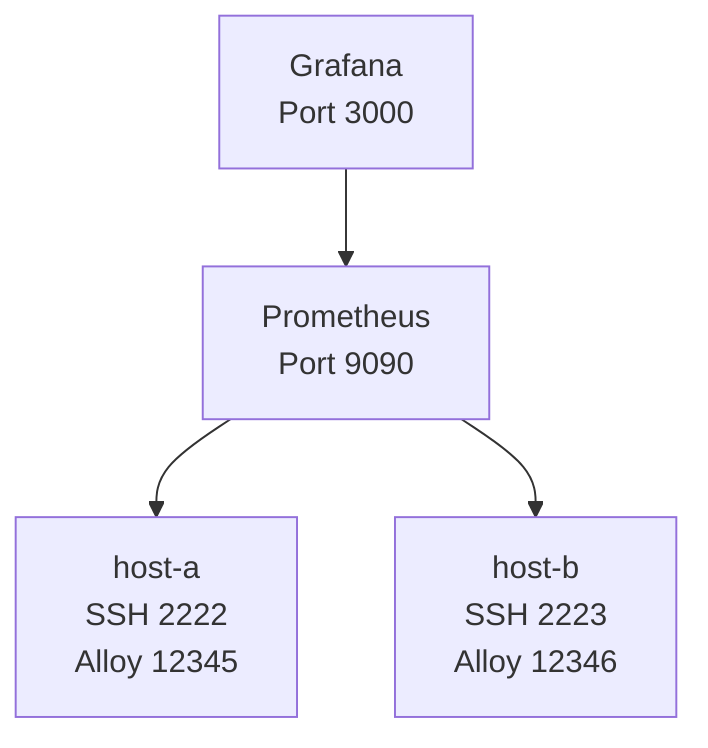
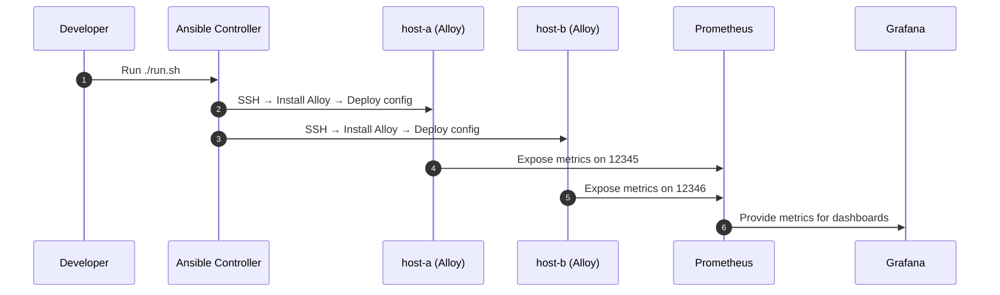

# Ansible-Project (Docker + Ansible + Alloy + Prometheus + Grafana)

## Project Overview
This environment builds a local observability stack with:
• Two SSH‑enabled hosts (host‑a, host‑b)
• Prometheus for metrics collection
• Grafana for visualization
• Ansible for provisioning and Alloy deployment
All components run on a shared Docker network called observability.

## Architecture Diagram



## Directory Overview


## Runbook

### Startup**

```bash
docker compose up --build -d
```
### Validate SSH
```bash
ssh -i ssh/id_rsa root@127.0.0.1 -p 2222
ssh -i ssh/id_rsa root@127.0.0.1 -p 2223
```
### Validate SSH and Provision Hosts 
Run from root directory of project
```bash
./run.sh
```
## Service Flow

### SSH
SSHD Dockerfile installs sshd on provisioned Ubuntu machines ```host-a, host-b```

### Ansible
Playbook pulls Alloy and deploys to hosts ```/ec/alloy/config.alloy```

### Alloy
Federated deployment that sends metrics to Prometheus writing to volume

## Prometheus
Ingests Alloy metrics and local scrape config. UI targets found at 
```
http://localhost:9090/targets
```
Host alert rules
* High CPU Usage
  * targets down >2m
* High Memory Usage
  * > 90% of virtual memory for 5m
* Low Disk Space
  * < 10% disk space
* Slow Scrapes
  * p90 scrape > 5s for 10m

## Grafana
```
http://localhost:3000
```
Metrics for host-a and host-b with prometheus alert rules. Templated Label to switch between hosts and services

### SRE Observability Dashboard


### Teardown
